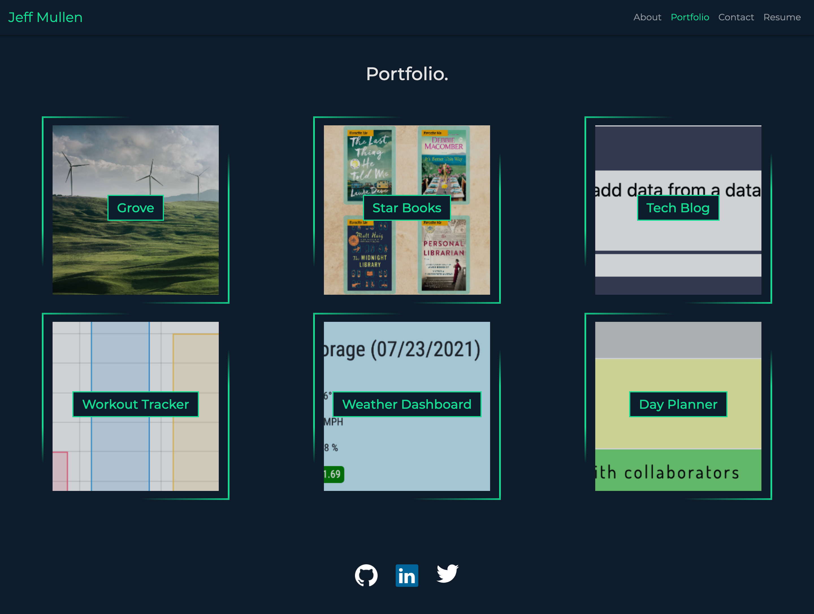

# React Portfolio

The Live [Web Application](https://jeffmullen.github.io/portfolio-react/)

  ## Table of Contents
  * [Description](#description)
  * [Technologies Used](#technologies-used)
  * [Questions](#questions)

  ## License 
This project is covered under the MIT License.
    
  
  
  Click on the badge to see **MIT License** details.

  ## Description
  Portfolio using React's method of rendering and storing stateful information.  React-Bootstrap was used for the navbar, while vanilla Bootstrap was used for layout.

  

  ## Technologies Used
  * React

  * React-Bootstrap

  * JavaScript

  * SCSS

  ## Questions
  
  [github.com/jeffMullen](https://github.com/jeffMullen)

  If you have additional questions, feel free to reach me at jeffmullendev@gmail.com
